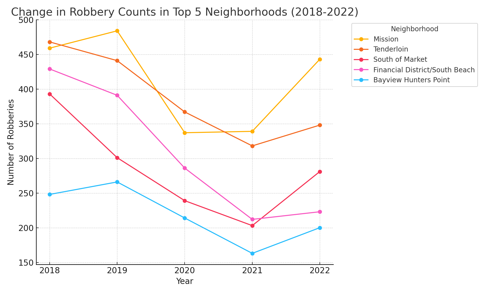
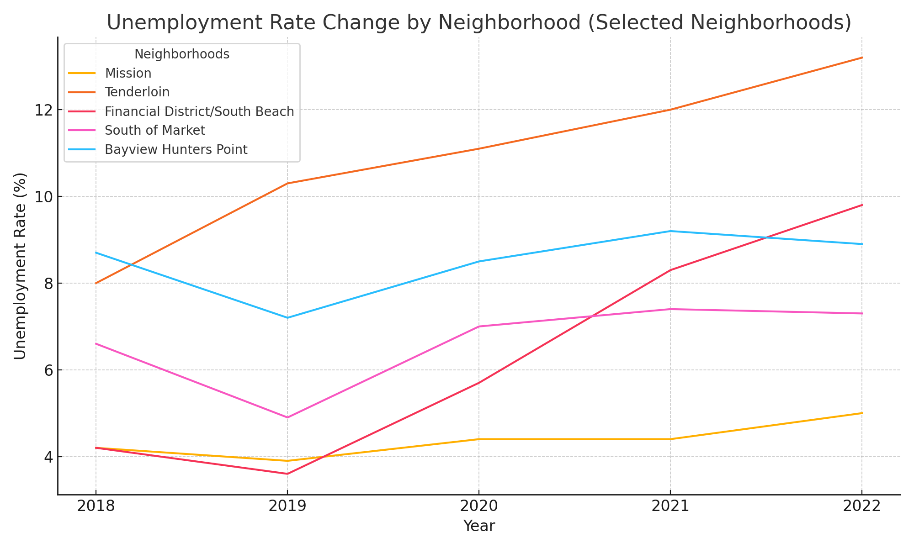
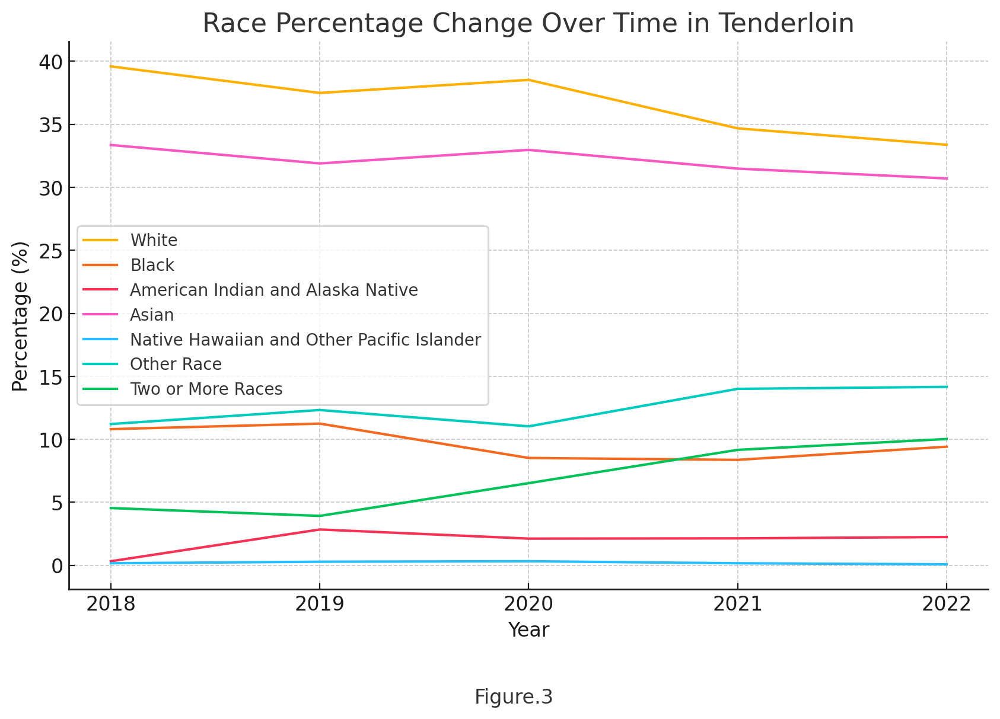
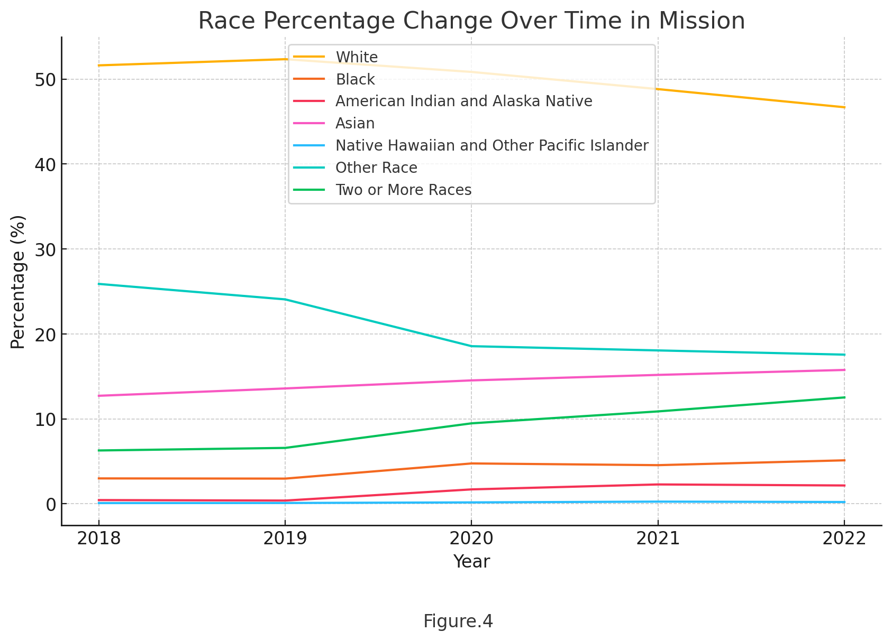
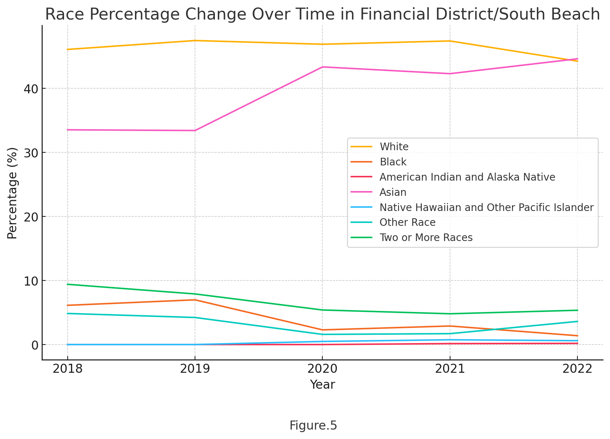
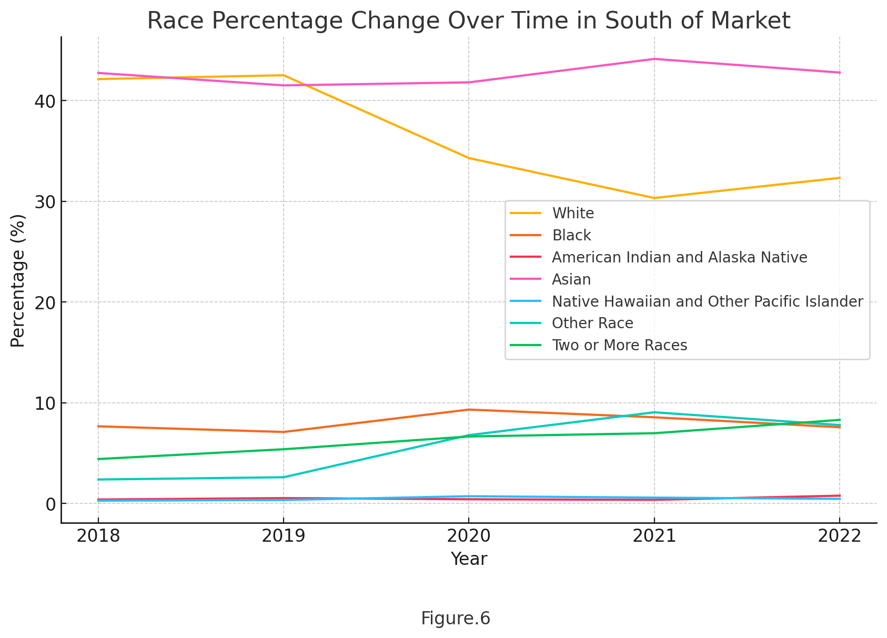
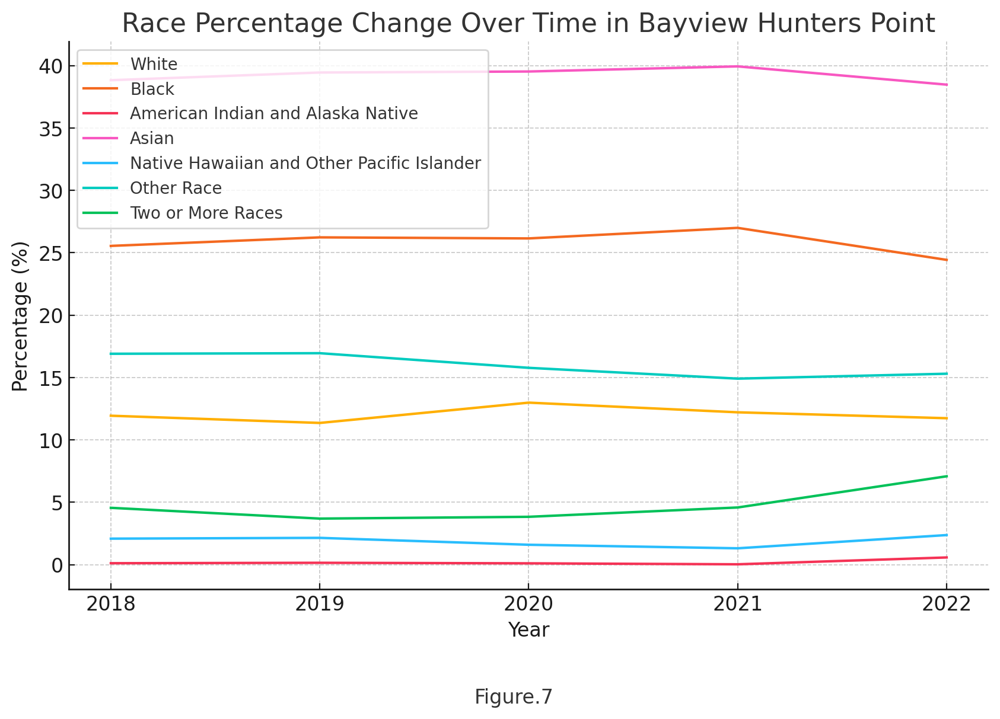

# Examining the Impact of Demographic and Employment Changes on Robbery Rates in San Francisco Neighborhoods
Weichun Liao
## Introduction
San Francisco, a city renowned for its vibrant and diverse communities, has long been a prime pilot site for urban research. In recent years, San Francisco's crime problem has become increasingly difficult to ignore, with robbery playing an important part in it. Feldmeyer et al. (2018) and Kramer (2024) both talk about the phenomenon of systematically attributing crime growth to immigrants or minorities, which weighs heavily on my mind. As a result, I write this blog to explore the relationship between changes in racial demographics, unemployment rates, and robbery rates across five Top Robbery-crimed neighborhoods. I hope to use this research to understanding some of factors that might influence the robbery crimes, and provide some perspectives for future policy-making. 
## Research Goals and Methodology
My analysis aims to:
Identify the top five neighborhoods with the highest robbery numbers; 
Analyze the correlation between changes in robbery rates and changes in racial demographic proportions; 
Investigate whether unemployment rate changes influence robbery rates.
To achieve the goal, I use quantitative methods. I collected the following data and converted them from Census Tract into Analysis Neighborhood format through excel. Subsequently, I combined the data from each Analysis Neighborhood and used Python to perform data analysis, measure correlations, test p-values, and generate charts.

## Data Sources
The data used in this analysis includes:
### Analysis Neighborhood Map:
[API 2020 census tracts assigned to neighborhoods](https://data.sfgov.org/resource/sevw-6tgi.json).
### Robbery Data: 
[Robbery incidents from 2018 to 2022 across various neighborhoods in San Francisco](https://data.sfgov.org/Public-Safety/Police-Department-Incident-Reports-2018-to-Present/wg3w-h783/about_data).  
### Demographic Data: 
[Racial demographic proportions per neighborhood](https://data.census.gov/table/ACSDT5Y2022.B02001?t=Race%20and%20Ethnicity&g=050XX00US06075$1400000).
### Unemployment Data: 
[Unemployment rates per neighborhood](https://data.census.gov/table?t=Employment&g=050XX00US06075$1400000). 

## Identifying the Top 5 Neighborhoods
Aggregating robbery data across all years, I identified the following neighborhoods as having the highest total robbery counts:
Tenderloin, Mission, Financial District/South Beach, South of Market, Bayview Hunters Point
These neighborhoods are the focus of my subsequent analyses. Figure.1 shows how numbers of robbery incidents change overtime. 

Figure.1

## Analyzing Unemployment Rate Changes and Robbery Rates
To investigate whether unemployment rates impact robbery rates, I first visualized changes in unemployment rates over time in these five neighborhoods as Figure.2. Then, I came up with a null hypothesis that the unemployment rate does not affects the number of robberies. I calculated the correlation coefficient and p-value between changes in the unemployment rate and robbery rates across the five neighborhoods. 

Figure.2

### Results Summary:
#### Mission Neighborhood
Correlation: -0.24
P-Value: 0.70
##### Interpretation: No significant relationship found between the unemployment rate and robbery counts.
#### Tenderloin Neighborhood
Correlation: -0.88
P-Value: 0.0496
##### Interpretation: Significant negative correlation between the unemployment rate and robbery counts (P-Value < 0.05). As the unemployment rate decreases, robberies tend to increase.
#### Financial District/South Beach Neighborhood
Correlation: -0.91
P-Value: 0.0294
##### Interpretation: Significant negative correlation between the unemployment rate and robbery counts (P-Value < 0.05). As the unemployment rate decreases, robberies tend to increase.
#### South of Market Neighborhood
Correlation: -0.39
P-Value: 0.52
##### Interpretation: No significant relationship found between the unemployment rate and robbery counts.
Bayview Hunters Point Neighborhood
Correlation: -0.82
P-Value: 0.0917
##### Interpretation: Moderate negative correlation between the unemployment rate and robbery counts, but the relationship is not statistically significant (P-Value > 0.05).
#### Summary
For the Tenderloin and Financial District/South Beach neighborhoods, the p-values are below 0.05, indicating significant evidence to reject the null hypothesis in these neighborhoods.But contrary to expectations, there is a negative correlation between the unemployment rate and the robbery crime rate. For other neighborhoods, there is no linear correlation between unemployment rate and robbery crime rate.

## Analyzing Demographic Changes and Robbery Rates
To understand the relationship between changes in robbery counts and racial demographics, I created line charts of these five neighborhood (From Figure.3 - Figure.7), and then decided to consider the proportions of four main racial groups:
White
Black
Asian
Other Race

The null hypothesis is changes in the proportion of each racial group do not affect robbery crimes. I calculated the correlation coefficient, p-value, and R² score for changes in these proportions relative to changes in robbery counts in each neighborhood.
### Result Summary
#### Mission Neighborhood:
##### Black Proportion Change:
Coefficient: -8097
p-value: 0.8464
R² Score: 0.4800
##### White Proportion Change:
Coefficient: -128
p-value: 0.5081
R² Score: 0.0003
##### Asian Proportion Change:
Coefficient: -48444
p-value: 0.8997
R² Score: 0.6389
##### Other Race Proportion Change:
Coefficient: 4030
p-value: 0.0448
R² Score: 0.8288
##### Interpretation:
Strong negative correlations between changes in robbery counts and both Black and Asian proportion changes suggest that decreases in these demographics are associated with increases in robberies.
Positive correlation with Other Race proportion changes.

#### Tenderloin Neighborhood:
##### Black Proportion Change:
Coefficient: 2262
p-value: 0.0771
R² Score: 0.7153
##### White Proportion Change:
Coefficient: -461
p-value: 0.6054
R² Score: 0.0444
##### Asian Proportion Change:
Coefficient: -1616
p-value: 0.7194
R² Score: 0.1925
##### Other Race Proportion Change:
Coefficient: 136
p-value: 0.4726
R² Score: 0.0030
##### Interpretation:
Strong positive correlation between changes in robbery counts and Black proportion changes.
Moderate to weak negative correlations with Asian and White proportion changes.

#### Financial District/South Beach Neighborhood:
##### Black Proportion Change:
Coefficient: 781
p-value: 0.2991
R² Score: 0.1615
##### White Proportion Change:
Coefficient: -1367
p-value: 0.7698
R² Score: 0.2912
##### Asian Proportion Change:
Coefficient: -490
p-value: 0.7444
R² Score: 0.2390
##### Other Race Proportion Change:
Coefficient: 2347
p-value: 0.0570
R² Score: 0.7851
##### Interpretation:
Moderate positive correlation with Black proportion changes.
Strong positive correlation with Other Race proportion changes.
Moderate to strong negative correlations with White and Asian proportion changes.

#### South of Market Neighborhood:
##### Black Proportion Change:
Coefficient: -2030
p-value: 0.7059
R² Score: 0.1696
##### White Proportion Change:
Coefficient: 786
p-value: 0.2567
R² Score: 0.2369
##### Asian Proportion Change:
Coefficient: -1051
p-value: 0.6215
R² Score: 0.0591
##### Other Race Proportion Change:
Coefficient: -1823
p-value: 0.7918
R² Score: 0.3405
##### Interpretation:
Moderate negative correlations with changes in Black and Asian proportions.
Moderate positive correlation with White proportion changes.
Negative correlation with Other Race proportion changes.

#### Bayview Hunters Point Neighborhood:
##### Black Proportion Change:
Coefficient: -1807
p-value: 0.8080
R² Score: 0.3794
##### White Proportion Change:
Coefficient: -1986
p-value: 0.7415
R² Score: 0.2333
##### Asian Proportion Change:
Coefficient: -2716
p-value: 0.7767
R² Score: 0.3062
##### Other Race Proportion Change:
Coefficient: 6167
p-value: 0.0066
R² Score: 0.9736
##### Interpretation:
Strong negative correlations with Black, White, and Asian proportion changes.
Very strong positive correlation with Other Race proportion changes.
#### Summary
Through a series of one-tailed p-value calculations, I evaluate this hypothesis which posits that changes in the proportion of each racial group do not significantly affect robbery crimes for each neighborhood:
Black Population: Across all neighborhoods, the p-values exceed the significance threshold of 0.05, indicating that changes in the Black population proportion do not significantly impact robbery crimes; 
White Population: Similarly, changes in the White population proportion are found to have no significant effect on robbery crimes across all neighborhoods; 
Asian Population: Consistent with the previous findings, changes in the Asian population proportion do not yield statistically significant impacts on robbery crimes; 
Other Race Population: Notably, the null hypothesis is rejected for the Mission and Bayview Hunters Point neighborhoods, signifying that changes in the proportion of residents from Other Races exert a significant influence on robbery crimes in these areas.

## Conclusion
The analysis revealed different relationships between demographic changes and robbery rates in the top five neighborhoods. The results showed that changes in the proportion of blacks, whites and Asians did not significantly affect robbery crime in all five neighborhoods. But in the Mission and Bayview Hunters Point neighborhoods, changes in the proportion of the population of other races had a significant impact on robbery crime. Of course, more research is needed to explore whether changes in the racial composition of neighborhoods lead to changes in robbery crime rates. Second, and surprisingly, the study demonstrated no statistically significant relationship between unemployment and robbery rates, challenging the widely held assumption that high unemployment leads to increased crime. And moreover, in the Tenderloin and Financial District/South Beach neighborhoods, the phenomenon that lower unemployment rates lead to increased robbery crime rates deserves more in-depth study. Understanding the complex interactions between unemployment, demographic changes, and crime rates can help policymakers and communities develop more effective crime prevention strategies. Exploring other socioeconomic factors, such as education, housing affordability, and community programs, can yield deeper insights into the crime phenomenon. This may be my goal for future projects.

## References
#### Feldmeyer, B., Steffensmeier, D., Harris, C. T., & Tasharrofi, S. (2018). Immigration and violent crime in california, 1980-2012: Contextualization by temporal period and Race/Ethnicity. Migration Letters, 15(2), 197-214. Retrieved from https://www-proquest-com.libproxy.berkeley.edu/scholarly-journals/immigration-violent-crime-california-1980-2012/docview/2148531004/se-2.
#### Kramer, C. W. (2024). Systemic Racism in Crime: Do Blacks Commit More Crimes Than Whites? Liberty Matters. https://oll.libertyfund.org/publications/liberty-matters/2024-02-13-systemic-racism-in-crime-do-blacks-commit-more-crimes-than-whites.
